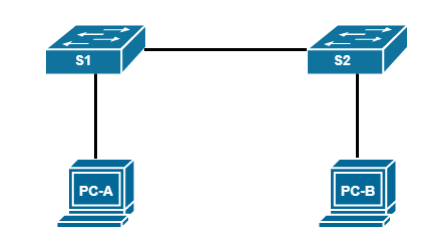

# Laboratory work №3. Viewing the Switch MAC address table

## Topology

## Addressing table

| Device | Interface | IP-address   | Subnet        | Default gateway | 
|--------|-----------|--------------|---------------|-----------------|
| S1     | VLAN 1    | 192.168.0.11 | 255.255.255.0 | -               |
| S2     | VLAN 1    | 192.168.0.12 | 255.255.255.0 | -               |
| PC-A   | NIC       | 192.168.0.3  | 255.255.255.0 | -               |
| PC-B   | NIC       | 192.168.0.2  | 255.255.255.0 | -               |

## Part 1: Creating and configuring a network

### Step 1: Connect all the devices according to the topology

### Step 2: Configure the PC nodes

### Step 3: Configure the basic parameters of each switch

1. Configure the device names according to the topology.
2. Configure the IP addresses as indicated in the addressing table.
3. Assign cisco as console and VTY passwords.
4. Assign class as the privileged EXEC mode password.

## Part 2: Studying the Switch MAC address table

### Step 1: Write down the MAC addresses of the network devices.

Open a command prompt on PC-A and PC-B and enter a command to display the physical
addresses of the computers.

Command

<code>
ipconfig /all
</code>

MAC address of the PC-A computer:
_______________________________
MAC address of PC-B computer:
_______________________________

What part of the MAC address of these devices corresponds to the OUI?

<code>
    (Organizational Unique Identifier) The part of the MAC address that identifies the vendor of the network adapter. 
The OUI is the first three bytes of the six-byte field and is administered by the IEEE.
</code>

Which part of the MAC address of these devices corresponds to the serial number?

<code>
The last three bytes of the six-byte field.
</code>

### Step 2: View the switch MAC address table.

1. Are any MAC addresses recorded in the MAC address table?
2. Which MAC addresses are recorded in the table? Which switch ports are they mapped to and which
   devices do they belong to? Ignore the MAC addresses associated with
   the CPU.
3. If you did not record the MAC addresses of network devices in step 1, how can you determine which
   devices the MAC addresses belong to using only the output of the command for
   displaying a table of MAC addresses? Does this solution work in any situation?

Command to display the mac address

<code>
S2# show mac address-table
</code>

### Step 3: Clear the MAC address table of the switch S2 and display the MAC address table again.

1. Clear the MAC address table.
2. Quickly display the contents of the switching table again. Does it specify the MAC address for
   VLAN 1? Are other MAC addresses specified?

After 10 seconds, enter the command to display the MAC address table again and
press enter. Have new addresses appeared in it?

Command to clear the MAC address table

<code>
S2# clear mac address-table dynamic
</code>

### Step 4: From PC-B, send echo requests to devices on the network and view the switch MAC address table.

1. On PC-B, open a command prompt and enter a command to display
   the node's ARP cache. Not counting multicast and broadcast addresses, how many pairs of IP and MAC addresses of
   devices were received via the ARP protocol?
2. From the BCP command line, send echo requests to the PC-A computer, as well as S1 and S1 switches
   S2. Have you received responses from all devices?
3. After connecting via the console to the switch S2, enter the command to display
   tables of MAC addresses. Has the switch added additional MAC addresses to this table? If
   yes, what are the addresses and devices?
4. On PC-B, open the command prompt and enter the command from item "a" again.
   Have additional entries appeared in the ARP cache of the PC-B computer for all network devices
   to which echo requests were sent?

Displays current ARP-records

<code>
arp -a
</code>

Deleting current ARP-records

<code>
arp -d
</code>

