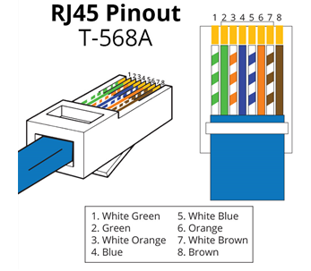

# Laboratory work №2. Production of a crossover cable Ethernet

## Analysis of standards and wiring diagrams for Ethernet cable contacts

The TIA/EIA standards define the rules for the use of unshielded twisted pairs (UTP) in local area networks. TIA/EIA 568-A and 568-B are commercial cable standards for local area networks; they are widely used in local area networks of organizations and, among other things, determine the color of each cable for different contacts.

### Use a straight cable to connect:
- Switch with router
- Computer with hub
### Use a cross cable to connect:
- Switch with switch
- Switch with hub
- Hub with hub
- Router with Router
- Computer with computer
- Computer with router

### TIA/EIA 568-A standard Ethernet cable.
#### Straight through cable

| Contact number | Pair number | Wire color   |
|----------------|-------------|--------------|
| 1              | 2           | White/Green  |
| 2              | 2           | Green        |
| 3              | 3           | White/Orange |     
| 4              | 1           | Blue         |
| 5              | 1           | White/Blue   |
| 6              | 3           | Orange       |
| 7              | 4           | White/Brown  |
| 8              | 4           | Brown        |

### TIA/EIA 568-B standard Ethernet cable.
#### Crossover cable

| Contact number | Pair number | Wire color   |
|----------------|-------------|--------------|
| 1              | 2           | White/Orange |
| 2              | 2           | Orange       |
| 3              | 3           | White/Green  |     
| 4              | 1           | Blue         |
| 5              | 1           | White/Blue   |
| 6              | 3           | Green        |
| 7              | 4           | White/Brown  |
| 8              | 4           | Brown        |

