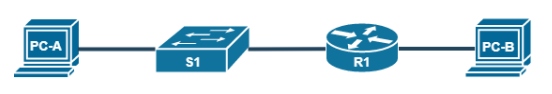

# Laboratory work №4.Creating a network consisting of a switch and a router

## Topology

## Addressing table

| Device | Interface | IP-address  | Subnet        | Default gateway | 
|--------|-----------|-------------|---------------|-----------------|
| R1     | G0/0      | 192.168.0.1 | 255.255.255.0 | -               |
| R1     | G0/1      | 192.168.1.1 | 255.255.255.0 | -               |
| PC-A   | NIC       | 192.168.1.3 | 255.255.255.0 | 192.168.1.1     |
| PC-B   | NIC       | 192.168.0.3 | 255.255.255.0 | 192.168.0.1     |

## Part 1: Device Setup and Connection Verification

### Step 1: Make static IP addressing settings on the PC interfaces.

1. Configure the IP address, subnet mask and default gateway parameters on the PC-A
   computer according to the addressing table.
2. Configure the IP address, subnet mask and parameters on the PC-B computer the default gateway
   according to the addressing table.
3. Send an echo request to PC-B from the PC-A command line.

Why did the communication check fail?

### Step 2: Configure the router.

<ol>
   <li>
      

      
Activate privileged EXEC mode.

      <code>
      Router> enable
      </code>
      

   </li>

   <li>
      

      
Enter global configuration mode.

      <code>
      Router# configure terminal
      </code>
      

   </li>

   <li>
      

      
Assign the router a device name according to the addressing table.

      <code>
      Router> hostname R1
      </code>
      

   </li>

   <li>
      

      
Disable DNS lookup to prevent the router from trying to convert incorrectly entered commands as if they were host names.

      <code>
      R1(config)# no ip domain-lookup 
      </code>
      

   </li>

   <li>
      

      
Assign <b>class</b> as the encrypted password of the privileged mode EXEC.

      <code>
      R1(config)# enable secret class
      </code>
      

   </li>

   <li>
      

      
Assign <b>cisco</b> as the console password and enable password login mode.

<pre>
R1(config)# line console 0
R1(config-line)# password cisco
R1(config-line)# login
</pre>
      

   </li>

   <li>
      

      
Assign <b>cisco</b> as the password of the virtual terminal and enable password login.

<pre>
R1(config)# line vty 0 15
R1(config-line)# password cisco
R1(config-line)# login     
</pre>
      

   </li>

   <li>
      

      
Encrypt the public passwords.

      <code>
      R1(config)# service password-encryption
      </code>
      

   </li>

   <li>
      

      
Create a banner warning about the prohibition of unauthorized access to the device.

      <code>
      R1(config)# banner motd #Unauthorized access to this device is prohibited!#
      </code>
      

   </li>

   <li>
      

      
Configure and activate both interfaces on the router.

<pre>
R1(config)# interface G0/0
R1(config-if)# ip address 192.168.0.1 255.255.255.0
R1(config-if)# no shutdown
R1(config)# interface G0/1
R1(config-if)# ip address 192.168.1.1 255.255.255.0
R1(config-if)# no shutdown
</pre>
      

   </li>

  <li>
      

      
For each interface, enter a description indicating which device is connected to it.

<pre>
R1(config)#interface G0/0
R1(config-if)#desc
R1(config-if)#description SomeDescription
</pre>
      

   </li>

   <li>
      

      
Save the current configuration file to the boot configuration file.

      <code>
      R1# copy running-config startup-config      
      </code>
      

   </li>

  <li>
      

      
Set the time on the router.

      <code>
      R1# clock set 14:19:00 Oct 26 2022
      </code>
      

   </li>

   <li>
      

      
Test the PC-B computer by sending an echo request to the PC-A computer from the command line window.

      <code>
      C:\>ping 192.168.1.3
      </code>
      

   </li>
</ol>

Has the communication check been completed successfully? Why?

<code>
Yes, the request was completed successfully. The router sent an ICMP packet from one subnet to another and back.
</code>

