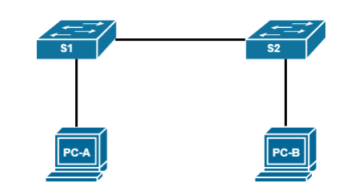

# Laboratory work №1. Building a simple network

## Topology

## Addressing table

| Device | Interface | IP-address   | Subnet        |
|--------|-----------|--------------|---------------|
| PC-A   | NIC       | 192.168.0.10 | 255.255.255.0 |
| PC-B   | NIC       | 192.168.0.11 | 255.255.255.0 |
| S1     | VLAN 1    | 192.168.0.1  | 255.255.255.0 |
| S2     | VLAN 1    | 192.168.0.2  | 255.255.255.0 |

## Basic setup and verification of switch settings

### Step 1: Enter privileged EXEC mode.

What command did you use?

<code>
Switch> enable
</code>

### Step 2: Enter global configuration mode.

What command did you use?

<code>
Switch# configure terminal
</code>

### Step 3: Give the switch a name.

What command did you use?

<code>
Switch(config)# hostname some_switch
</code>

### Step 4: Prevent the switch from trying to translate bad commands as if they are node names.

What command did you use?

<code>
Switch(config)# no ip domain-lookup
</code>

What can happen if you skip this action?

By default, any single word entered on an IOS device 
that is not recognized as a valid command is treated 
as a hostname to which you want to telnet. The device
will try to translate that word to an IP address in a 
process that can last about a minute.

### Step 5: Enter local passwords.

<ol>
    <li>
        

        
Set a password to enter privileged mode.

        <code>Switch(config)# enable secret cisco</code>
        

    </li>
    <li>
        

        
Set a password to access the console port and make it prompt password.

<pre>
Switch(config)# line console 0
Switch(config-line)# password cisco
Switch(config-line)# login
</pre>
        

    </li>
    <li>
        

        
Set a password for accessing VTY lines and make it prompt for this password.

<pre>
Switch(config)# line vty 0 15
Switch(config-line)# password cisco
Switch(config-line)# login
</pre>
        

    </li>
</ol>

### Step 6: Enter the MOTD banner.

Create a banner with your message

<code>
Switch(config)# no ip domain-lookup
</code>

### Step 7: Set the IP address of the SVI interface.

Set a password for accessing VTY lines and make it prompt for this password.

<pre>
Switch(config)# interface vlan1
Switch(config-if)# ip address 192.168.0.1 255.255.255.0
Switch(config-if)# no shutdown
</pre>

### Step 8: Save the configuration.

What command did you use?

<code>
Switch# copy running-config startup-config
</code>

### Step 9: Display the current configuration.

What command did you use?

<code>
Switch# show running-config
</code>

### Step 10: Display the IOS version and other switch information.

What command did you use?

<code>
Switch# show version
</code>

### Step 11: Display the status of connected switch interfaces.

What command did you use?

<code>
Switch# show ip interface brief
</code>

### Step 12: Connect to the S1 switch using the Telnet protocol.

What command did you use?

<code>
telnet 192.168.0.1
</code>

